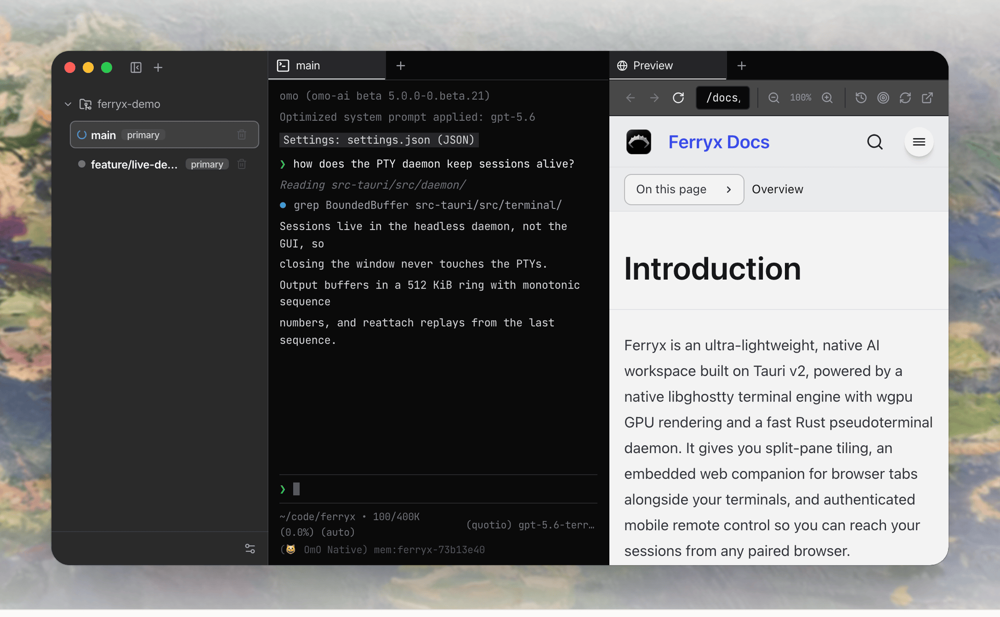

<div align="center">

[English](README.md) | [简体中文](README.zh-CN.md)


# Ferryx

### 并行智能体开发，零冗余。

原生 Ghostty 终端引擎、wgpu GPU 渲染，以及无头 Rust PTY 守护进程。
完全不使用 Electron。

[**下载**](https://github.com/Indosaram/ferryx/releases/latest) &nbsp;·&nbsp;
[**网站**](https://ferryx.dev/) &nbsp;·&nbsp;
[**文档**](https://ferryx.dev/docs/introduction/) &nbsp;·&nbsp;
[**Discord**](https://discord.gg/Z2hBkQEHUG)

<br />



<sub>智能体在原生终端窗格中工作，旁边分屏显示嵌入式浏览器标签。</sub>

</div>

---

## 下载

| 平台 | 软件包 | |
| :--- | :--- | :--- |
| **macOS** | 通用 DMG（Apple Silicon 和 Intel） | [`.dmg`](https://github.com/Indosaram/ferryx/releases/latest/download/Ferryx_universal.dmg) |
| **Windows** | 安装程序（x64，目前尚未进行代码签名） | [`.exe`](https://github.com/Indosaram/ferryx/releases/latest/download/Ferryx_x64-setup.exe) |
| **Linux** | 便携式 AppImage（x64） | [`.AppImage`](https://github.com/Indosaram/ferryx/releases/latest/download/Ferryx_amd64.AppImage) |
| **Linux** | Debian / Ubuntu 软件包（x64） | [`.deb`](https://github.com/Indosaram/ferryx/releases/latest/download/Ferryx_amd64.deb) |
| **Linux（无头）** | 服务器 / VPS PTY 守护进程和 CLI（x64） | [`install.sh`](https://relay.ferryx.dev/install.sh)（`curl -fsSL https://relay.ferryx.dev/install.sh | bash`） |

macOS、Windows 和 Linux 的下载链接会指向最新版本。进行本地发行版组装时，会将无头版 `ferryx-cli` 放在 Linux AppImage 和 `.deb` 旁边（文件名为
`ferryx-cli-linux-amd64`）；如果存在通用 macOS CLI，也会将其作为
`ferryx-cli-darwin-universal` 一同放置。因此，上面的一行安装命令在发行版包含当前构建产物时会解析到该产物，否则会安全失败。请使用与二进制文件一同发布的 `SHA256SUMS.txt` 验证下载：

```bash
sha256sum -c SHA256SUMS.txt
```

## 速度、隔离与完全掌控

每一层都围绕低延迟和智能体自主协作进行设计。

### 原生 Ghostty 与 wgpu 引擎

桌面终端窗格通过原生 libghostty 和 GPU 加速的 wgpu
管线渲染，提供清晰的字体栅格化效果和低延迟吞吐。

- libghostty 终端核心
- wgpu GPU 管线
- 离屏 WGPU 渲染基准：Apple M4 Max 上 50 帧 p50 为 3.10 ms

### 多智能体工作区

在彼此隔离的分屏窗格中并行运行 AI 编码智能体（Claude Code、Codex、Gemini CLI），
并查看实时状态指示。

- 每个智能体使用独立 worktree
- 实时状态指示
- 可直接从标签栏启动

### 灵活的分屏平铺

支持任意垂直和水平分屏，提供指针拖动调整大小和流畅的布局过渡。

- 垂直和水平分屏
- 指针拖动调整大小
- 可将标签拖到任意窗格

### 移动端网页配对

通过 QR 码或 PIN 进行身份验证后远程访问。将终端输出流式传输到无需依赖的
DOM 终端网格，并随时随地操控智能体。

- 6 位 PIN 配对
- 流式终端网格
- 用手机操控智能体

### 远程 Linux 机器配对（无需 SSH）

将无头 Linux 服务器、VPS 和云实例配对为拥有项目的机器。
Ferryx 使用仅向外发起的中继隧道，因此位于 NAT 或防火墙之后，或没有公网 IP / 开放 SSH 端口的机器也能顺畅连接。
如需使用自己的中继服务而不是默认服务，请遵循
[自托管中继指南](https://ferryx.dev/docs/self-hosted-relay/)，了解 TLS、邮件投递、机器注册，以及独立的桌面账户和网关设置。

- 无头 `ferryx-cli` 不需要显示服务器；在 Linux 上，其共享 crate 仍会链接 GTK 3 和 WebKitGTK 4.1
- 仅向外发起的加密中继隧道：无需入站 SSH、开放端口或公网 IP
- 原生终端分屏和远程 Git worktree 可直接在该机器上运行

```bash
# 1. 在远程机器上通过一行命令安装 ferryx-cli（Linux x64、macOS）
curl -fsSL https://relay.ferryx.dev/install.sh | bash

# 2. 在专用服务或终端中启动无头 PTY 守护进程；
#    此前台进程运行时，请使用第二个终端执行第 3 步。
ferryx-cli --daemon

# 3. 通过电子邮件 magic link 将机器关联到账户（无需开放端口或在 GUI 中复制 PIN）
ferryx-cli account login --email you@example.com --origin https://your-account-service.example
# 在电子邮件中打开授权链接；命令会等待批准。
# 配置了 FERRYX_ACCOUNT_ORIGIN 时，可省略 --origin。
```

### 零 Electron 开销

使用 Tauri v2 和平台原生 WebKit 或 WebView2 引擎，并搭配无头
Rust PTY 守护进程。核心支持 macOS、Windows 和 Linux；launchd、Dock 徽章、彩色 emoji 和窗口材质等部分操作系统集成仍以 macOS 为主。

- Tauri v2 外壳
- 无头 Rust PTY 守护进程
- macOS、Windows、Linux

### 可靠的持久化

工作区状态会自动生成快照，GUI 可以重新连接到正在运行的守护进程。
关闭 GUI 后，由守护进程拥有的进程仍会继续运行；停止守护进程或重启主机仍可能终止正在运行的 PTY。

- 布局快照
- 守护进程在 GUI 关闭后仍会运行
- 重新连接时重放输出

## 架构各有不同

Ferryx 原生 Ghostty 和 Rust 组件的架构清单。这不是与基于 Electron 的 AI IDE 或终端模拟器之间的性能基准比较。

| 架构组件 | Ferryx 实现 |
| :--- | :--- |
| 终端解析器 | libghostty-vt |
| 桌面渲染 | WGPU 原生子表面 |
| PTY 生命周期 | 带输出重放的无头 Rust 守护进程 |
| 嵌入式浏览器 | 原生 WebView 分屏标签 |
| 移动端配对 | 带自定义 DOM 终端网格的 PIN / QR 网关 |
| 智能体监控 | 基于清单的状态检测和通知 |

## 指南与比较

实用操作指南：

- [并行运行编码智能体](https://ferryx.dev/use-cases/parallel-ai-agents/)：说明智能体为何会在共享工作目录中相互冲突，以及如何通过每个智能体独立使用一个 worktree 来解决
- [Git worktree 实践](https://ferryx.dev/use-cases/git-worktree-workflow/)：手动命令，以及手动流程何时会变得繁琐
- [远程终端访问](https://ferryx.dev/use-cases/remote-terminal-access/)：如何通过手机查看长时间运行的任务

基于架构和许可条款对比其他方案，不作未经测量的性能声明：

- [Ferryx 与 Warp 对比](https://ferryx.dev/compare/warp/)
- [Ferryx 与 Wave Terminal 对比](https://ferryx.dev/compare/wave-terminal/)
- [Ferryx 与 Conductor 对比](https://ferryx.dev/compare/conductor/)
- [Ferryx 与 Crystal / Nimbalyst 对比](https://ferryx.dev/compare/crystal/)
- [Ferryx 与 tmux + git worktree 对比](https://ferryx.dev/compare/tmux-git-worktree/)
- [Ferryx 与 Ghostty](https://ferryx.dev/compare/ghostty/)：Ferryx 嵌入 libghostty-vt，并非 Ghostty 的竞争产品

## 从源码构建

### 前置条件

- [Bun](https://bun.sh/) 1.1+
- [Rust](https://www.rust-lang.org/) stable（至少 1.82）
- [Node.js](https://nodejs.org/) 20+
- [Zig](https://ziglang.org/download/) 0.16.0（构建固定版本的 Ghostty 时需要）
- [Tauri CLI v2](https://v2.tauri.app/start/prerequisites/)

在 Linux 上，编译桌面或 CLI 二进制文件之前，请安装
[Tauri](https://v2.tauri.app/start/prerequisites/) 所需的 GTK 3、WebKitGTK 4.1 和其他系统库。

### 克隆并安装

```bash
git clone https://github.com/Indosaram/ferryx.git
cd ferryx
git submodule update --init --recursive
bun install
bun install --cwd ui
bun install --cwd site
```

### 运行桌面应用

Tauri 外壳会启动 `src-tauri/tauri.conf.json` 中定义的 UI 开发服务器：

```bash
cd src-tauri && cargo tauri dev
```

### 运行网站和文档

Astro + Starlight，端口为 14173：

```bash
bun run --cwd site dev
```

- 首页：<http://localhost:14173/>
- 文档：<http://localhost:14173/docs/introduction/>
- 快捷键参考：<http://localhost:14173/docs/shortcuts/>

### 验证更改

```bash
bun run --cwd ui build
bun run --cwd ui test
BASE_URL=/ bun run --cwd site build
cargo check --manifest-path src-tauri/Cargo.toml
```

## 架构

```text
ferryx/
├── src-tauri/   # Rust Tauri v2 核心：PTY 守护进程、IPC、通知、远程网关
├── ui/          # React 前端：原生终端表面、布局、远程配对
├── site/        # Astro + Starlight 首页和文档，部署到 Cloudflare Workers
└── docs/        # 规格说明、审计日志和参考资料
```

**Rust 原生核心（`src-tauri`）**负责伪终端生命周期、管理 Git worktree 租约、承载原生子 WebView，并运行用于移动端配对的、经过身份验证的 Axum WebSocket 网关。终端会话由无头守护进程而非 GUI 管理，因此关闭窗口不会影响 PTY。输出会写入带单调递增序列号的环形缓冲区；重新连接时会从上次的序列号继续重放。

**前端（`ui`）**是运行在 WebKit 或 WebView2 中的 React 外壳，负责窗格平铺、智能体标题检测、键盘快捷键和终端搜索覆盖层。

**网站（`site`）**是 Astro 和 Starlight 静态构建，用于托管首页、指南，以及一个运行真实产品组件的嵌入式演示。

## 参与贡献

欢迎贡献代码。请从 `main` 创建分支，运行上述验证命令，并在拉取请求中说明用户可见的结果。

欢迎通过 [Discord](https://discord.gg/Z2hBkQEHUG) 提出问题和想法。

## 许可证

本项目采用 [Sustainable Use License (SUL-1.0)](LICENSE)：允许个人、非商业用途和内部业务使用；分发须遵守其非商业条款并包含所需声明。

## 代码签名政策

由 [SignPath.io](https://signpath.io) 提供免费代码签名，证书由 [SignPath Foundation](https://signpath.org) 提供。

- **维护者**：[@Indosaram](https://github.com/Indosaram)
- **隐私**：Ferryx 会在本地存储工作区数据。远程访问、嵌入式网站、外部编码智能体和更新服务可能通过网络交换数据。有关数据处理和删除选项，请参阅 [Ferryx 隐私政策](https://ferryx.dev/privacy/)。
